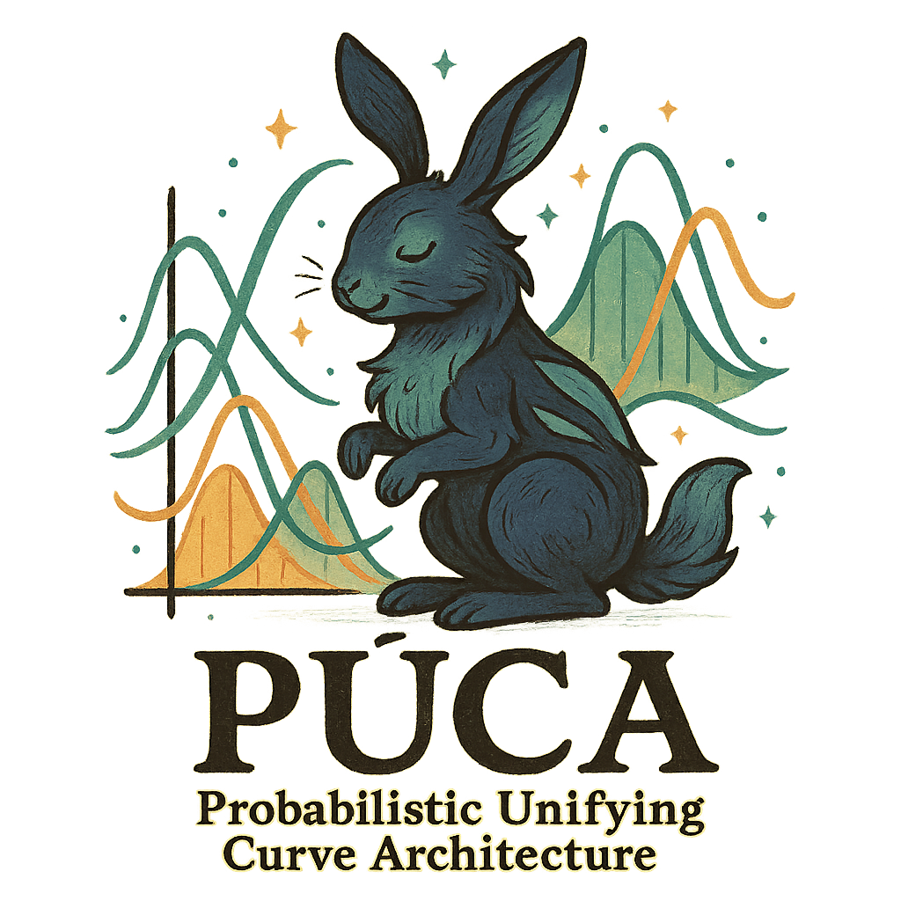

# Púca (Poo-kah): Probabilistic Unifying Curve Architecture

## Goal 

## Brief overview of methods implemented 

## Examples of public health forecasting 

## Exampels of XXX forecasting 

## Contributors:
tom mcandrew - mcandrew@lehigh.edu (https://compuncertlab.org/)
Garrik Hoyt - gah223@lehigh.edu
